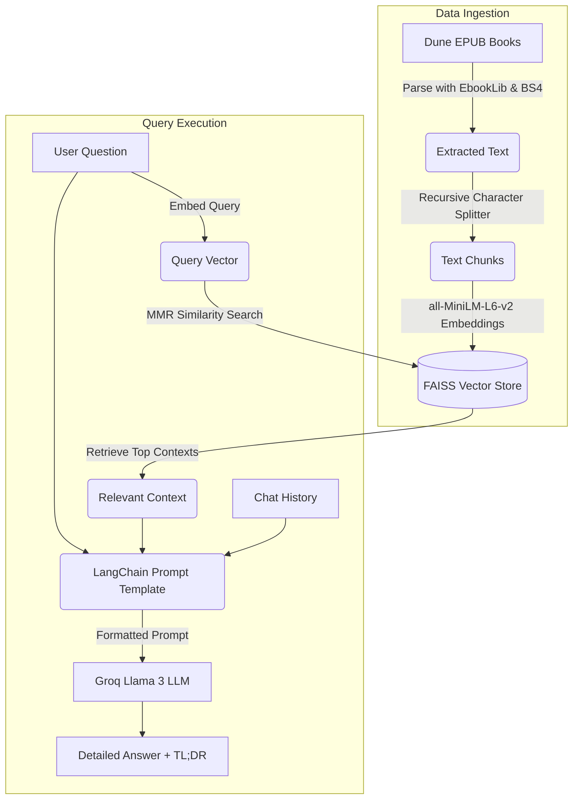

# Dune RAG: Conversational AI Encyclopedia

## 📖 Description
Dune RAG is a Retrieval-Augmented Generation (RAG) system built to act as a conversational encyclopedia for Frank Herbert's *Dune* universe. By ingesting `.epub` files of the Dune books, it processes the text, embeds it into a vector store, and allows users to ask detailed questions about the lore, characters, and events of the series. The system uses a conversational memory chain, providing context-aware answers and a TL;DR for quick reading. It also includes an evaluation script using RAGAS to measure the system's faithfulness, answer relevancy, and context precision.

## ⚙️ System Requirements
- Python 3.8+
- Apple Silicon Mac (M1/M2/M3) - *Note: The code currently hardcodes `device: "mps"` for embeddings. To run on Windows/Linux, change this to `"cpu"` or `"cuda"` in `app.py`, `ingest.py`, and `evaluate.py`.*
- Valid Groq API Key
- `.epub` copies of the Dune books placed in a `books/` directory at the project root.

## 🛠 Tech Stack
- **Language**: Python
- **LLM**: Meta LLaMA 3 models via **Groq API** (`llama-3.3-70b-versatile` and `llama-3.1-8b-instant`)
- **Embeddings**: HuggingFace (`all-MiniLM-L6-v2`)
- **Vector Database**: FAISS (Facebook AI Similarity Search)
- **Orchestration**: LangChain
- **Data Parsing**: `ebooklib`, `BeautifulSoup`
- **Evaluation**: Ragas Framework

## 🔄 Workflow Flowchart



## 🚀 Running Commands

1. **Install Dependencies**
   Ensure you have a virtual environment activated, then install the required packages:
   ```bash
   pip install -r requirements.txt
   ```

2. **Setup Environment Variables**
   Create a `.env` file in the root directory and add your Groq API key:
   ```env
   GROQ_API_KEY=your_groq_api_key_here
   ```

3. **Ingest the Data**
   Place your Dune `.epub` files inside a folder named `books/` in the project root. Then run the ingestion script to create the FAISS index:
   ```bash
   python ingest.py
   ```

4. **Run the Conversational App**
   Start the interactive chat interface:
   ```bash
   python app.py
   ```

5. **Evaluate the RAG System**
   Run the evaluation script to test the system's accuracy using the RAGAS framework:
   ```bash
   python evaluate.py
   ```

## 🎯 Example Output

**You**: What is the spice melange?

**Answer**: 
The spice melange, often simply referred to as "the spice," is a profoundly important and highly valuable substance found exclusively on the desert planet of Arrakis (Dune). It is produced by the giant sandworms of Arrakis. The spice has several critical functions:
1. It is a geriatric drug that significantly extends human life and provides increased vitality.
2. It expands consciousness and unlocks prescient (future-seeing) abilities, which are essential for the Spacing Guild Navigators to safely fold space and enable interstellar travel.
3. It is highly addictive, and withdrawal from the spice is fatal. Those heavily exposed to it develop distinct, entirely blue eyes, known as the "Eyes of Ibad."

TL;DR: The spice melange is a life-extending, consciousness-expanding drug found only on Arrakis, essential for space travel and highly addictive.

**You**: Who controls the production of it?

**Answer**: 
Based on the context and our previous discussion about the spice melange, the production of the spice on Arrakis is ultimately controlled by whoever the Padishah Emperor assigns to rule the planet in a pseudo-fiefdom.

At the beginning of the series, the Emperor transfers control of Arrakis from House Harkonnen (who ruled it brutally for 80 years) to House Atreides. However, the deep desert harvesting is incredibly dangerous due to the giant sandworms that produce it. Furthermore, the native Fremen people have their own secret relationship with the spice and the sandworms, effectively controlling the deep desert where the most spice is found, away from the official off-worlder harvesting operations.

TL;DR: The Emperor officially grants control of Arrakis and its spice mining to Great Houses (like Harkonnen or Atreides), but the native Fremen control the deep desert where it originates.
